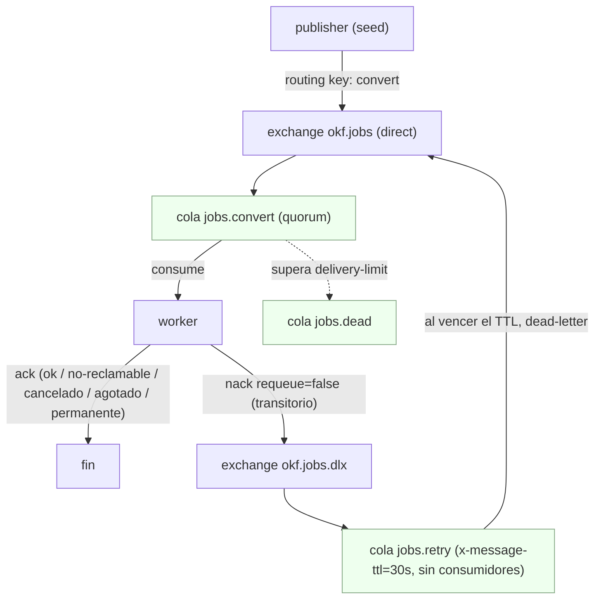
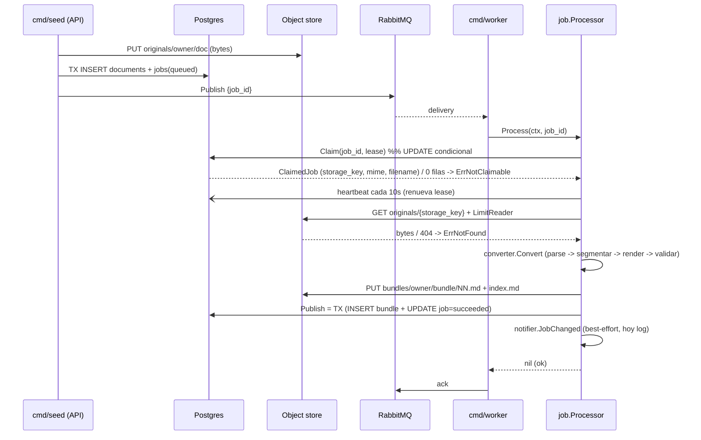
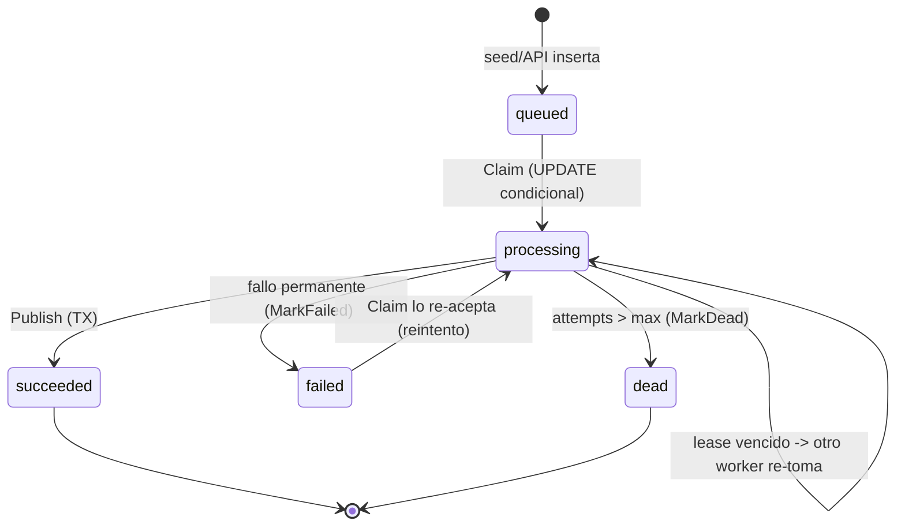
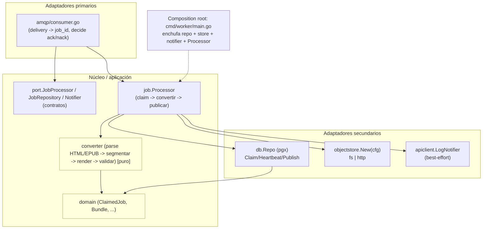

# Diagrama de la solución actual (paso 2)

Estado: flujo real de punta a punta **con base de datos, sin Docker**. **Postgres es la
fuente de verdad** del estado del trabajo; la cola solo AVISA que hay trabajo. El
archivo NO viaja por RabbitMQ (patrón *Claim Check*): va por el object store y por la
cola solo viaja el `job_id`.

Dos ideas centrales:

- **La cola avisa, la base de datos autoriza.** El worker no procesa el mensaje: toma
  el trabajo en Postgres (`Claim`, un UPDATE condicional) y de ahí relee la
  `storage_key`, el `mime` y el `filename`. Nada de eso viaja ya en el mensaje.
- **El object store** tiene dos backends intercambiables por `STORAGE_BACKEND`, ambos
  detrás del puerto `Store`: `fs` (carpeta local) y `http` (servicio `object-storage`
  por red, `GET`/`PUT` a `/v1/objects/{key}` con `Bearer`). Los diagramas muestran `http`.

---

## 1. Flujo de punta a punta

```mermaid
flowchart LR
    mocks["testdata/mocks/*.html"]

    subgraph SEED["cmd/seed (hace de API)"]
        s1["1. leer .html"]
        s2["2. store.Put(originals/owner/doc)"]
        s3["3. TX: INSERT documents + jobs(queued)"]
        s4["4. publicar {job_id}"]
    end

    subgraph BROKER["RabbitMQ"]
        q["cola jobs.convert (quorum)"]
    end

    subgraph WORKER["cmd/worker (consumidor)"]
        w1["5. Claim(job_id) -> doc"]
        w2["6. store.Get(storage_key) + LimitReader"]
        w3["7. converter.Convert (parse/segmentar/render/validar)"]
        w4["8. store.Put(bundles/owner/bundle/...)"]
        w5["9. Publish: TX bundle + job=succeeded"]
        w6["10. ack"]
    end

    subgraph DB[("Postgres (fuente de verdad)")]
        tj["jobs / documents / bundles"]
    end

    subgraph STORE["Object store (fs | servicio http)"]
        orig["originals/owner/doc  (bruto)"]
        bund["bundles/owner/bundle/*.md (procesado)"]
    end

    mocks --> s1 --> s2 --> s3 --> s4
    s2 -. "PUT bytes" .-> orig
    s3 -. "INSERT" .-> tj
    s4 -- "job_id" --> q
    q --> w1 --> w2 --> w3 --> w4 --> w5 --> w6
    w1 -. "UPDATE ... processing" .-> tj
    w2 -. "GET" .-> orig
    w4 -. "PUT" .-> bund
    w5 -. "COMMIT" .-> tj

    classDef store fill:#eef,stroke:#88a
    classDef db fill:#fde,stroke:#a68
    class orig,bund store
    class tj db
```

Clave: por la cola (`s4 -> q`) solo va `{job_id}`. Los **bytes** van por el object
store (flechas a `originals`/`bundles`) y el **estado** por Postgres. El worker relee
de la BD todo lo que necesita al hacer `Claim`.

---

## 2. Topología de RabbitMQ (colas, reintento y DLX)

Declarada e idempotente en `amqp/topology.go`. Los reintentos usan una "sala de espera"
con TTL, sin consumidores, para conseguir backoff gratis.



Decisión de ack/nack (la toma `consumer.go` a partir del error del `Processor`):

- **ack** — éxito; o `ErrNotClaimable` (reentrega duplicada / ya terminado / cancelado);
  o `ErrCancelled`; o `ErrExhausted` (ya marcado `dead`); o `ErrPermanent` (MIME/archivo).
- **nack (requeue=false)** — transitorio (Postgres o el store caídos, timeout) → DLX →
  `jobs.retry` → vuelve a `jobs.convert` a los ~30 s.

---

## 3. Secuencia del camino feliz (con base de datos)



Dos órdenes que no se invierten: **primero el store (PUT), después el COMMIT** (al revés
dejaría filas apuntando a archivos inexistentes); y se **toma el trabajo (Claim) antes
de tocar nada**.

---

## 4. Ciclo de vida del trabajo (estados en `jobs.status`)



- `queued → processing`: solo si `status IN ('queued','failed')` **o** el lease venció.
  Esa condición viaja DENTRO del `WHERE` (comprobarla en Go sería una carrera).
- **Idempotencia**: una reentrega de un job ya `succeeded`/`processing` encuentra 0
  filas → `ErrNotClaimable` → ack, sin reprocesar.
- **Recuperación**: un worker muerto deja el job en `processing`; al vencer su lease,
  otro lo re-toma (sin esto, escalar hacia abajo perdería trabajos).

---

## 5. Arquitectura por piezas (hexagonal)

La regla de dependencia apunta hacia dentro: los adaptadores conocen el núcleo y los
puertos, nunca al revés.



---

## Qué es real y qué es andamio (hoy)

| Pieza | Estado |
|---|---|
| Mensajería RabbitMQ (topología, ack/nack, retry/DLX, reconexión, apagado) | ✅ real |
| Base de datos: Claim (idempotencia+lease), Heartbeat, Publish transaccional | ✅ real |
| Servicio `object-storage` (HTTP, Bearer, atómico, path-traversal) | ✅ real |
| Backends del worker: `fs` (carpeta) y `http` (servicio por red) | ✅ real |
| Conversor real: segmentador + renderer (frontmatter/index/log) + validador (§6) | ✅ real |
| Parsers: HTML y EPUB (`text/html`, `application/epub+zip`) | ✅ real |
| Notificación a la API (`apiclient.LogNotifier`) | 🟡 registra en log (el POST real llega con la API) |
| Otros parsers (markdown, texto, docx, pdf) y API real | ⛔ pendientes (ver `PENDIENTES.md`) |
| Docker / compose | ⛔ **paso 4 (pendiente)** |
